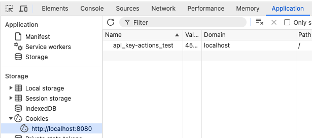

Developer Setup
===============

Requirements and Preparation
----------------------------

* GitHub: In order to commit to the `Plant-Tracer/webapp <https://github.com/Plant-Tracer/webapp>` GitHub repository, you must first have a GitHub account. Then your GitHub account must be added as a member of the Plant-Tracer Organization. You may ask any of the Organization owners to do that, or send an email request to plantadmin@planttracer.com.

* While there are multiple ways to authenticate a login to  GitHub, it has proven to be convenient for development purposes to use a Personal Access Token for acccess via a command line. See `<https://docs.github.com/en/authentication/keeping-your-account-and-data-secure/managing-your-personal-access-tokens>` and `<https://github.com/settings/personal-access-tokens>` for more details. (Specific token settings not yet fully documented, but you want Read and Write access to Contents. Depending on your role and your own toolset, you may also want access to Actions, Discussions, Pages, and Pull Requests, but also consider whether all those permissions should exist in the same PAT.)

* Select your development platform. This will likely have to do with the machines that are available for your use. Plant-Tracer/webapp is being deployed on a Linux host, so that's going to be the best place for runtime debugging. MacOS works well. Windows is not supported for either development or runtime. This file was developed on MacOS Sequoia but should be fine for Ubuntu and other Linuxes. See other doc files such as :doc: `DevSetupUbuntu` for more detail on setting up on that platforms.

* Install the following things on your development machine, in roughly the order presented, if they aren't already there. How to do that is beyond the scope of this document.

* Chrome web browser. While you can use most web browsers with Plant-Tracer/webapp, only Google Chrome and Chromium are used for application testing. So when dealing with development issues, make sure that work on Chrome before getting concerned about other browsers.

* Package installer. Have a package installer.
    * Homebrew. If installing on a MacOS machine, `HomeBrew <https://brew.sh>`_ must be installed prior to performing the steps below.
    * Chocolatey. If installing on a Windows machine, the Chocolatey package manager is recommended.
    * For Linux, use whatever is the favored package manager for that distro. For Ubuntu, it will be apt.

* Python3.11. Verify that typing 'python' gives you python3.11. If it doesn't, make sure that your PATH is up-to-date.

   * On ubuntu, sudo apt install python3.11-venv (if venv not available by default)

* make

* git and gh

* Minio  (installed locally)

* DynamoDBLocal (installed locally)

Setup Steps
-----------
#. Set your Git Hub name and username::
    git config --global --edit

#. Authenticate to GitHub. This steps to do this differs per platform, but probably involves install the gh (GitHub) CLI. See the platform specific Dev setup instructions for details of how to install gh. For example::

    gh auth login
    [ec2-user@dev-seb webapp]$ gh auth login
    ? Where do you use GitHub? GitHub.com
    ? What is your preferred protocol for Git operations on this host? HTTPS
    ? Authenticate Git with your GitHub credentials? Yes
    ?How would you like to authenticate GitHub CLI? Paste an authentication token
    ? Tip: you can generate a Personal Access Token here https://github.com/settings/tokens
    ? The minimum required scopes are 'repo', 'read:org', 'workflow'.
    ? Paste your authentication token: ***************************************************- gh - - gh config set -h github.com git_protocol https
    ✓ Configured git protocol
    ! Authentication credentials saved in plain text
    ✓ Logged in as yourusername

#. Clone the Plant Tracer webapp into a directory that will be the local repository, for example::

    git clone https://github.com/Plant-Tracer/webapp.git webapp

#. Change to the local repository directory::

    cd webapp

#. Make a Python Virtual Environment (venv)::

    make venv

#. Activate the venv::

    . venv/bin/activate

#. Install the prerequisites with make install-<your-os>, e.g.::

    make install-macos

#. Create a new local database with demo course

    .. code-block::

       export PLANTTRACER_CREDENTIALS=src/etc/credentials-localhost.ini
       make make-local-demo

#. Run the self-tests:

   .. code-block::

      make pytest

#. Create your first course!:

   * --course_name "My Course Name" is the name of the course you are creating. A course in PlantTracer is for a specific delivery of a course, or perhaps a section of a course. PlantTracer assets published in a course are available to all course members.

   * --course_id is a simple unique identfier for the course. (--course_name is more descriptive)

   * --admin-email is the email address for the first course administrator. It is useful to have a unique email address for the administrator role. For example, if your email address is joecool@company.com, then an admin email address might be joecool+admin@company.com

   * --admin-name "Your Name" should be unique for each admin registration. This is not absolutely necessary but it is helpful to tell under which account you have logged in when using PlantTracer.

   * Set up the environment as in the command below

   .. code-block::

    DYNAMODB_TABLE_PREFIX=demo- AWS_ACCESS_KEY_ID=minioadmin AWS_SECRET_ACCESS_KEY=minioadmin AWS_ENDPOINT_URL_S3=http://localhost:9100/ AWS_ENDPOINT_URL_DYNAMODB=http://localhost:8010/ AWS_DEFAULT_REGION=us-east-1 PLANTTRACER_S3_BUCKET=planttracer-local PLANTTRACER_CREDENTIALS=src/etc/credentials-localhost.ini venv/bin/python dbutil.py --create_course --course_name "Test Course" --course_id "test" --admin_email sbarber2+admin@gmail.com --admin_name "Steve Admin Barber"

#. The information for the new course will be output and look something like this:

   .. code-block::

    creating course...
    2025-08-07 17:42:36,177  odb.py:376 WARNING: NOTE: create_user does not check to make sure user sbarber2+admin@gmail.com's course test exists
    Transaction succeeded: user inserted.
    created test
    {
        "admins_for_course": [
            "udcaba1d8-3f26-4a62-86bc-46f4144c2d4c"
        ],
        "course_id": "test",
        "max_enrollment": "50",
        "course_name": "Test Course",
        "course_key": "2b32-4faf"
    }

#. Note the course_key value: this value is what to give users in order that they can register for the course.

#. In order run a non-demo instance, a mailer must be configured in the credentials ini file, for example:

   .. code-block::

    [smtp]
    SMTP_USERNAME=plantadmin@mycompany.com
    SMTP_PASSWORD=MyPassword
    SMTP_PORT=587
    SMTP_HOST=smtp.mycompany.com

    [imap]
    IMAP_USERNAME=plantadmin@mycompany.com
    IMAP_PASSWORD=MyPassword
    IMAP_HOST=imap.mycompany.com
    IMAP_PORT=993

#. The demo course has also added demo movies to the database. To finish setting up demo mode, run the server in non-demo mode, track all the demo movies manually, and publish them.

Running Locally Quick Start
---------------------------

#. Run Plant-Tracer/webapp locally using the database created above and the credentials file already specified in the PLANTTRACER_CREDENTIALS environment variable

   .. code-block::

    export PLANTTRACER_CREDENTIALS=src/etc/credentials-localhost.ini
    make run-local-debug # Ctrl-C to quit

#. Sometimes, it is necessary to manually clear the cookies that Plant-Tracer/webapp creates in a browser. These cookies are of the form "api_key-"+my_database_name. Here is an example:

