Plant Tracer Web App Tutorial
=============================

Welcome and Registration
-------------------------
- Go to `dev.planttracer.com/register`.
- Register for an account using your Course Key provided by your instructor.
- Alternately, you can register for a demo course which is called "dev" (enter "dev" in the box labeled Course Key.
- Enter your full name, email address, and Course Key.

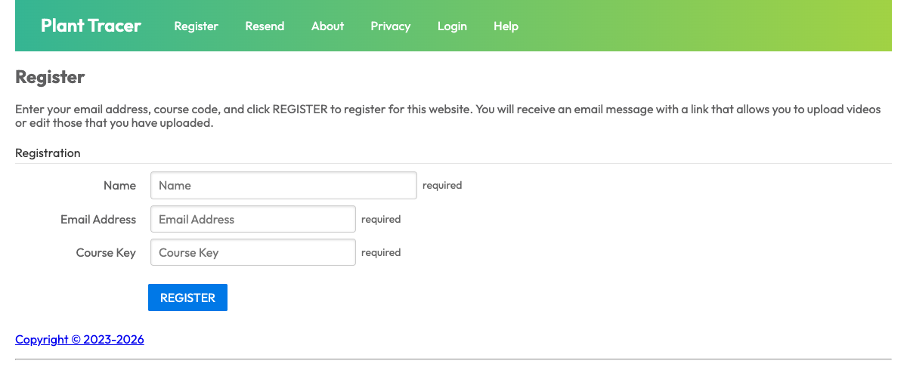

- Look for an email from `admin@planttracer.com`. Click on the second link to view movies. The first link will allow you to upload movies.
   
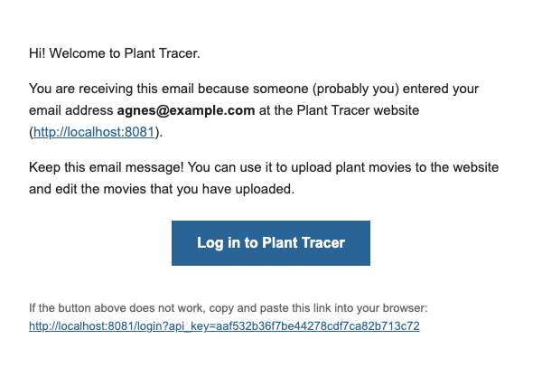

Viewing movies
--------------
- The second link in the email will bring you to the Welcome page. 
- Click on "Movies" in the menu bar at the top of the page to see a list of movies to analyze.

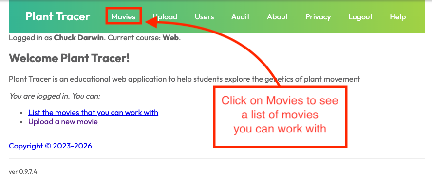

- Click on the analyze button to see the tracked movie.

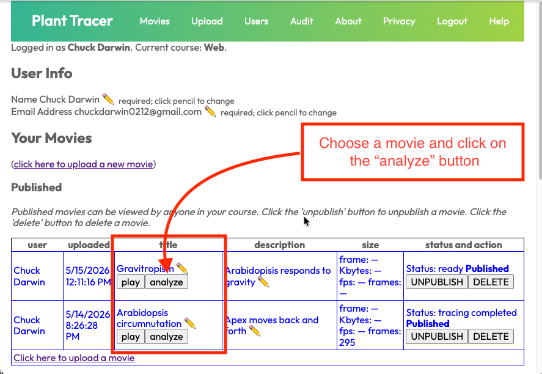

Uploading Movies (optional)
---------------------------
- From the menu bar at the top select Upload. 
- Enter the title of the file and a description of the movie.
- Choose a file to upload. Your movie file must be 64MB or less. If your file is larger than 64MB, you must use some other tool to reduce the file size.

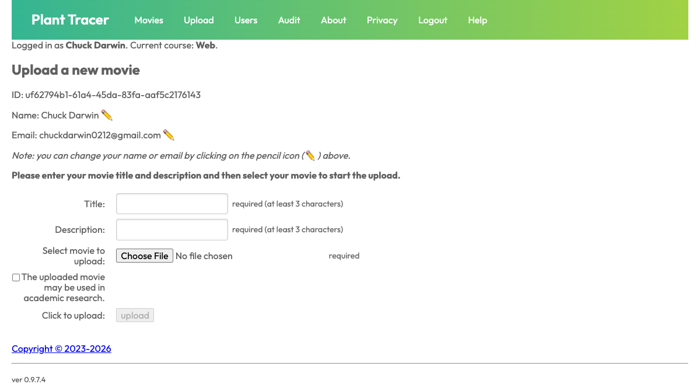

Tracking the Uploaded Movie
---------------------------
- Once the file is uploaded, you can choose to track it.
- In the bottom left of the page, click on the button labeled "Track the uploaded movie".

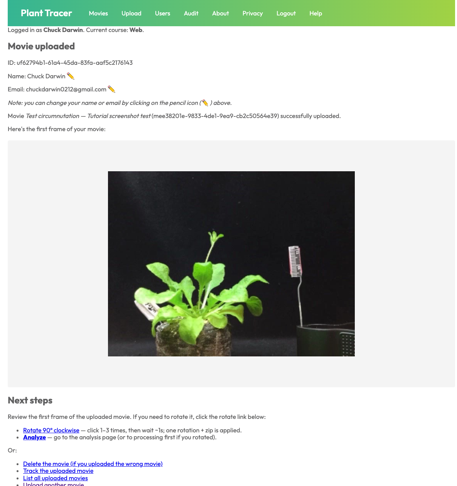

- There three markers in the left side of the first frame need to be moved. Click on them and move them to the correct location.

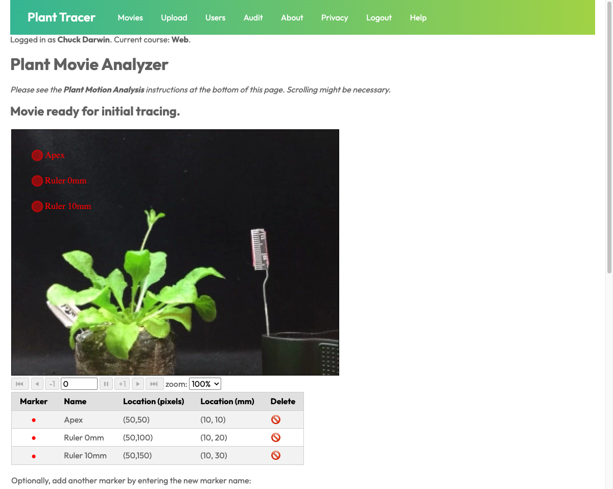

- The Apex marker, and ruler markers need to be moved to the appropriate location.

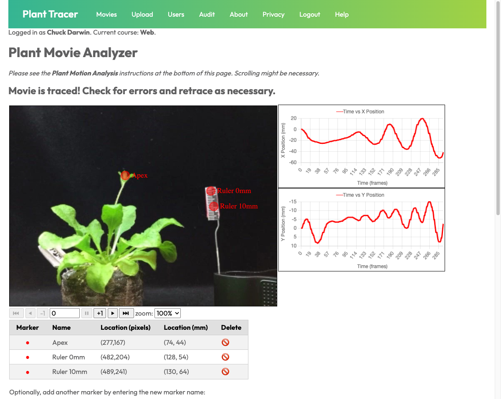

Viewing the trace of a Movie
----------------------------
- Once the tracked movie has loaded you will see the image if the first frame, the data table and the graphs of the movement.

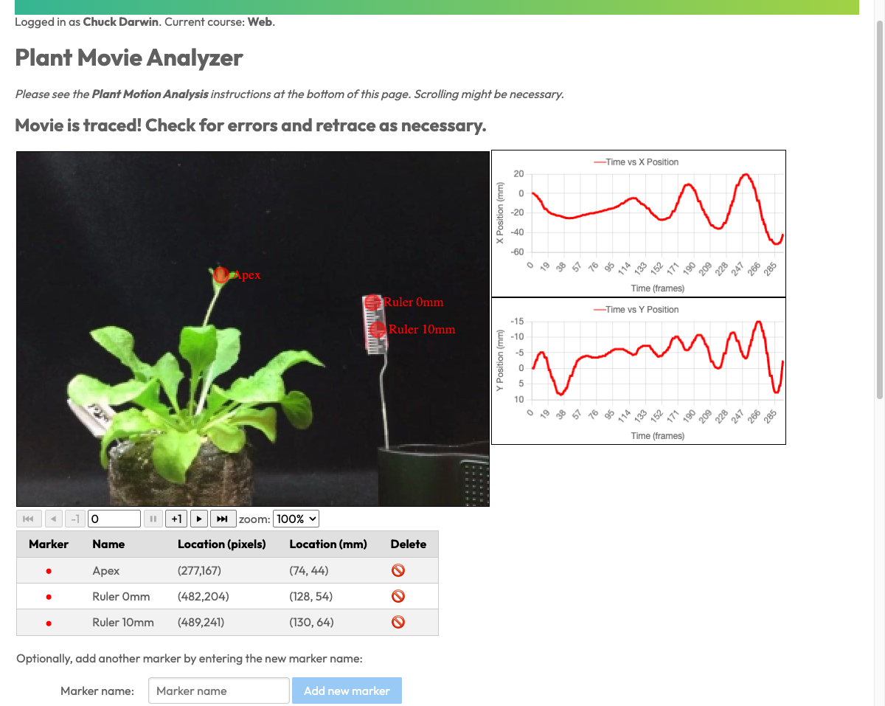

- Click on the play button to view the movement of the apex in all frames of the movie.

Interpreting and Reading Results
--------------------------------
- Use the arrow buttons just below the tracked movie to play, or navigate to a particular frame.
- Graphs help visualize the horizontal (x position) and vertical (y position).
- When you are satisfied with the tracking, you can hit the button "Download Trackpoints".
- At this point, you are ready to use a spreadsheet to analyze and graph the data.

.. image:: tutorial_images/download_trackpoints.png
   :alt: Reading Results in Plant Tracer

Further Adjustments to Tracking
-------------------------------
- You can enlarge the image of the movie to better view the markers and tracing.

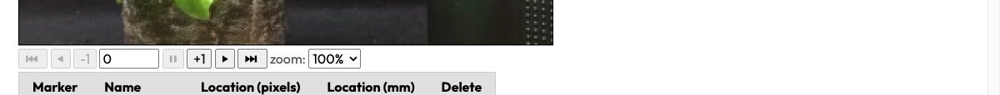

- You have the option of re-tracking the movie from that frame.

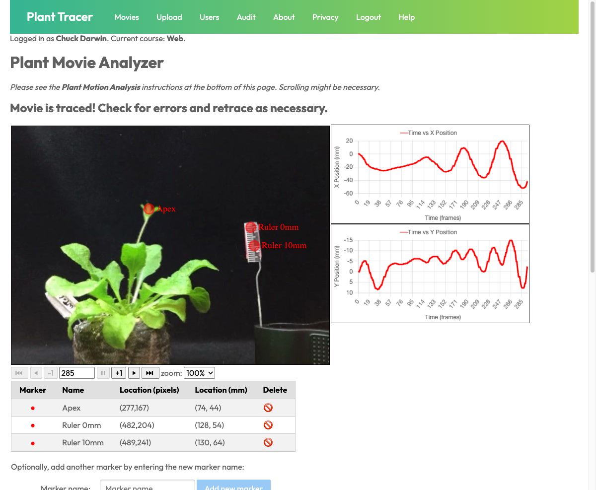

- Use the arrow buttons just below the original movie to navigate to the frame where tracking was lost.
- Then move the apex marker to the correct position. Now press the button "re-track movie".

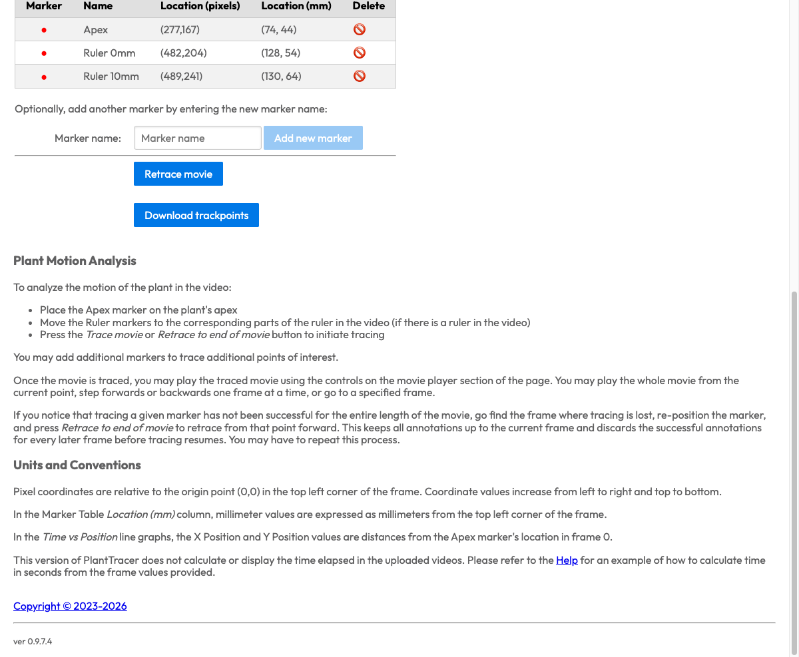