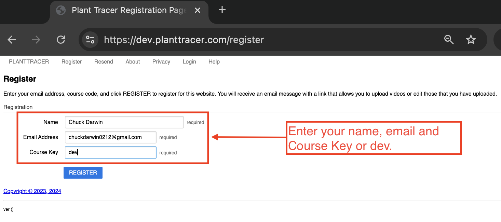

Plant Tracer Web App Tutorial
=============================

Welcome and Registration
-------------------------
- Go to `dev.planttracer.com/register`.
- Register for an account using your Course Key provided by your instructor.
- Alternately, you can register for a demo course which is called "dev" (enter "dev" in the box labeled Course Key.
- Enter your full name, email address, and Course Key.

- Look for an email from `admin@planttracer.com`. Click on the second link to view movies. The first link will allow you to upload movies.
   

Viewing movies
--------------
- The second link in the email will bring you to the Welcome page. 
- Click on "Movies" in the menu bar at the top of the page to see a list of movies to analyze.

- Click on the analyze button to see the tracked movie.

.. image:: tutorial_images/choose_analyze.png
   :alt: Selecting a sample movie on Plant Tracer

Uploading Movies (optional)
---------------------------
- From the menu bar at the top select Upload. 
- Enter the title of the file and a description of the movie.
- Choose a file to upload. Your movie file must be 256MB or less. If your file is larger than 256MB, you must use some other tool to reduce the file size prior to uploading.

.. image:: tutorial_images/upload_movie.png
   :alt: Uploading Movies on Plant Tracer

Tracking the Uploaded Movie
---------------------------
- Once the file is uploaded, you can choose to track it.
- In the bottom left of the page, click on the button labeled "Track the uploaded movie".

- PlantTracer places three markers on newly uploaded movies automatically. They initially appear on the left side of the movie frame. These also appear in the Marker Table to the right (or beneath) the video frame.
- PlantTracer will attempt to track the motion of whatever part of the image a marker is placed over, frame by frame. 
- It is the user's job to position the markers appropriately. To move a marker, click on it, and drag it to the desired location.
- You may use the Marker Table to add and delete markers whose names have meaning for your motion analysis. There may be any number of markers. Markers may not be renamed, so if you want to rename a marker, delete it and add another with the name you want.
- PlantTracer will attempt to track the motion related to every marker.
- Typically, the apex of some part of the plant is tracked. So, to do that, move the Apex marker, for example, to the top of the vertical stem.
- Marker that have names of the form RulerXXmm are special. XX is any non-negative integer. These markers are intended to be used for distance calibration. Using the default Ruler markers, if the image has a ruler in it, move the Ruler0mm marker to the beginning of the ruler in the image, and move the Ruler10mm marker to the 10mm mark on the ruler. In this way, PlantTracer can report analysis results in millimeters rather than numbers of pixels in the image.
- There can be any number of RulerXXmm markers, but PlantTracer will only use the RulerXXmm markers with the lowest and highest XX values in its calculations, and ignores any intermediate RulerXXmm markers for purposes of distance calculations. PlantTracer only uses mm distances.
- If there are fewer than two RulerXXmm markers on a given analysis, then analysis results are calclulated and presented using units of pixels.

.. image:: tutorial_images/moving_marker.png
   :alt: Tracking uploaded movie on Plant Tracer

- The Apex marker, and ruler markers need to be moved to the appropriate location.

Viewing the trace of a Movie
----------------------------
- Once the tracked movie has loaded you will see the image of the first frame, the data table and the graphs of the movement.

.. image:: tutorial_images/analyzed_movie.png
   :alt: Viewing the tracked movie, data and graphs on Plant Tracer

- Click on the play button to view the movement of the apex in all frames of the movie.

.. image:: tutorial_images/play_button.png
   :alt: Viewing the traced movie on Plant Tracer

Interpreting and Reading Results
--------------------------------
- Use the arrow buttons just below the tracked movie to play, or navigate to a particular frame.
- Graphs help visualize the horizontal (x position) and vertical (y position).
- When you are satisfied with the tracking, you can press the button "Download Trackpoints".
- At this point, you are ready to use a spreadsheet to analyze and graph the data.

.. image:: tutorial_images/download_trackpoints.png
   :alt: Reading Results in Plant Tracer

Further Adjustments to Tracking
-------------------------------
- You can enlarge the image of the movie to better view the markers and tracing.

.. image:: tutorial_images/movie_size_adjustment.png
   :alt: Adjusting the Zoom in Plant Tracer

- You have the option of re-tracking the movie from that frame.

- Use the arrow buttons just below the original movie to navigate to the frame where tracking was lost.
- Then move the apex marker to the correct position. Now press the button "re-track movie".

